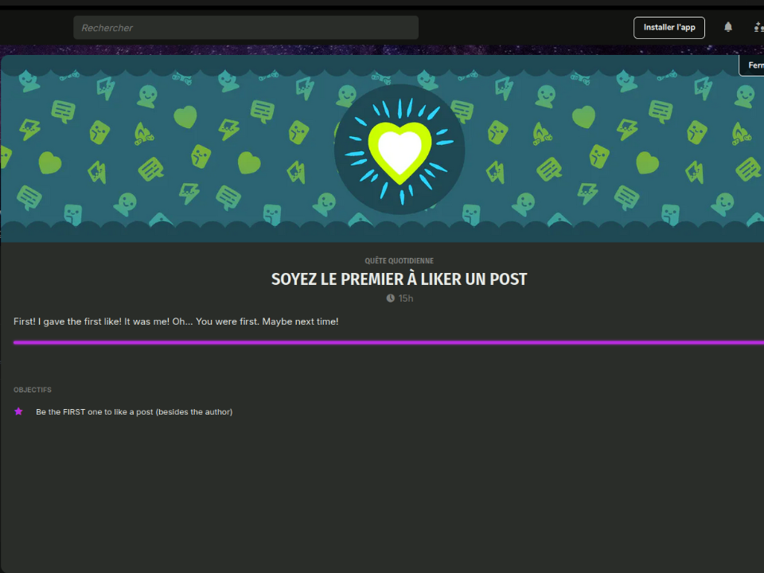

# Traduction française Game Jolt

  

Traduction française pour Game Jolt, implémentée sous forme de script pour Tampermonkey.
Installation

    Installez Tampermonkey ;

    Ouvrez le lien du script depuis GitHub ou GreasyFork ;

    Actualisez la page Game Jolt si elle était déjà ouverte ;

    Terminé !

# Notes et Crédits:
Ce script a été créé à la base par RushanM https://github.com/RushanM 

Il s'agissait d'un projet visant à traduire Gamejolt.com en russe. J'ai donc eu l'idée de faire un "fork" pour le traduire en français (France). Une version québécoise sera disponible plus tard dans le développement.
